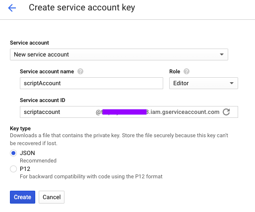

# Scripting For Testers

To see the full course:
https://www.linkedin.com/learning/scripting-for-testers

## Example Scripts

### Sending HTTP requests

Install module 'requests'

`python3 -m pip install requests`

1. requests/sending_requests.py
2. requests/requests_with_auth.py
3. requests/find_duplicate_urls.py

### Working with CSV files

Shows an example of how to read a csv file and extract data from it

1. csv_manipulation/working_with_csv.py

### Using Google Chart API

*Links:*
 - https://developers.google.com/chart/interactive/docs/basic_load_libs
 - https://developers.google.com/chart/interactive/docs/datatables_dataviews
 - https://developers.google.com/chart/interactive/docs/basic_draw_chart

1. google_chart_api/example1.py
 - uses methods from `csv_manipulation/working_with_csv.py` 
 - creates result in html file ex1_column_chart.html

2. google_chart_api/example2.py
 - uses randomly generated set of numbers (random_set.txt) to form the data set
 - builds column graph where data ranges are represented with different colors 
 - creates result in html file ex2_column_chart.html

*Links:*
 - https://www.random.org/integer-sets/?mode=advanced
 
3. google_chart_api/example3.py
 - uses data from `TestAnalysisData.csv`
 - builds column chart with two columns of data
 - creates result in html file ex3_column_chart.html
 
4. google_chart_api/build_pie_chart.py
 - parses data from `JiraJsonData.json`
 - builds Pie Chart 
 - creates result in html file ex4_cpie_chart.html
 
*Links:*
 - https://developers.google.com/chart/interactive/docs/gallery/piechart

### Google Spread Sheets

*Steps:*

1. https://console.developers.google.com/apis/dashboard

        Enable Services: Google Spread Sheets; Google Drive API

2. https://console.developers.google.com/apis/credentials

        Create Credentials -> Service account key
        
 
        
        Move created file to the working directory
                           
3. Give to the scripts access to the spreadsheets that we want shared with our client email

        Copy client_email from client_secret.json
        
        Go to the opened Spreadsheet and share it with the client_email
        
4. Install python modules

    `python3 -m pip install gspread`

    `python3 -m pip install google-api-python-client`
    
5. Additonal information on [gspread](https://gspread.readthedocs.io/en/latest/)
      

### Selenium WebDriver

1. Install selenium module for python

    `python3 -m pip install selenium`

2. Go to [Drivers](https://selenium-python.readthedocs.io/installation.html#drivers)
3. Choose drivers according to the browsers you going to run Selenium for and their versions

**Chrome:** Follow the steps from [Setup](https://sites.google.com/a/chromium.org/chromedriver/getting-started)
    
    My steps (MacOS):
    1. Check what paths are there: `cat /etc/paths`
    2. Copy driver: `cp <chromedriver> /usr/local/bin/`

**Firefox:** Go to [geckodriver](https://github.com/mozilla/geckodriver/) page

    My steps (MacOS):
    1. brew install geckodriver

#### Developer Tools -> Console

*Tips:*

1. To check if XPATH exists on the page

    `$x(<xpath>)`
    
    For example: 
    1. Open Developer Tools -> Console and type
    2. Go to https://www.seleniumhq.org/
    3. Choose element on the page and click Inspect
    4. Coy XPATH of the highlighted line
    5. Go to Console tab and enter `$x('//*[@id="q"]')`

2. Find elements on the page, examples
    
    `document.getElementsByTagName('p')`
    `document.getElementById('submit')`
    
